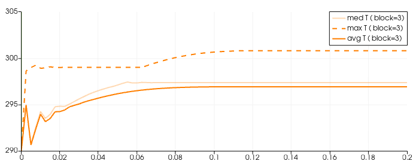
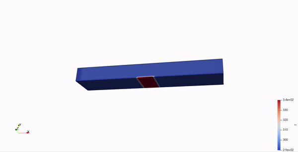
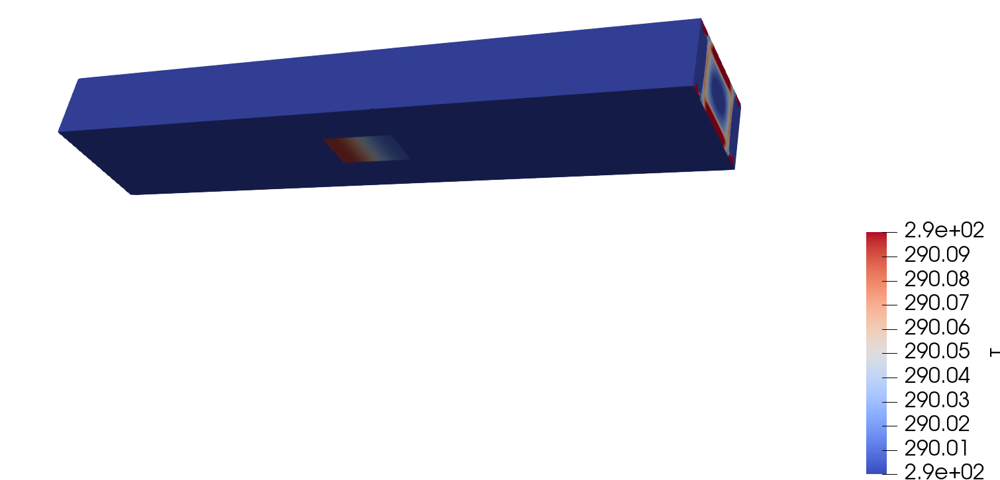
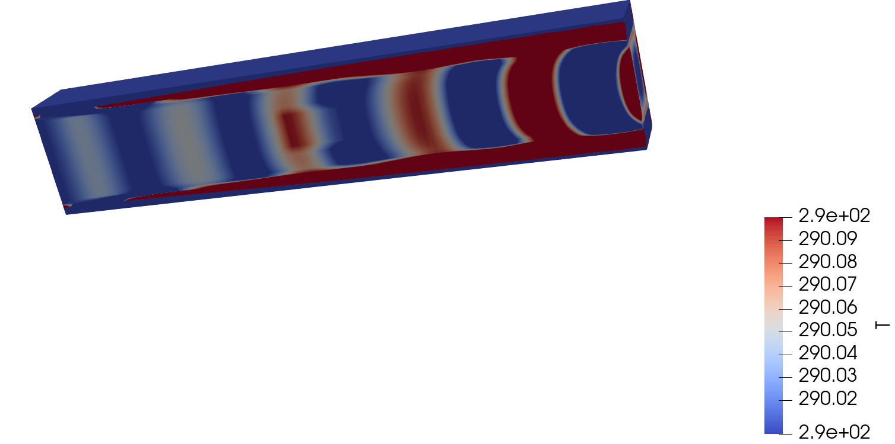

# CFD

### Simulations

#### Couette2

icoFoam

#### FixedTopWall

icoFoam

#### FixedTopWall2

icoFoam

#### flow-over-heated-plate

rhoPimpleFoam

from tutorial with small changes

#### heatedplate1

rhoPimpleFoam, adapted from #4 to square blockmesh

#### heatedplate2

rhoPimpleFoam, adapted from #5 to modify

#### heatedplate3

rhoPimpleFoam, moved from externalHeatFlux... to fixedGradient (boundary condition)

#### heatedplate4

more defined blockmesh and run for 1 second (opposed to .3 s)

#### FixedTopWall3

blockmesh is now 6by1 instead of 1by1. This to find where the flow fully develops

#### heatedplate5

realistic server size. not complete.

#### heatedplate5.1

using fixedGradient = 4400. determined with math. see this [link](https://www.cfd-online.com/Forums/openfoam-pre-processing/175229-fixedgradient-boundary-condition.html) for example of derivaiton. we assume W = 890, k = 12 (est/guess).

#### heatedplate5.2

same as 5.1 but using externalWallHeatFluxTemperature. with Q = 890 W 

#### heatedplate5.3

same as 5.2  but  using heatflux q = 890/(0.450 * 0.090) =~ 22000. 

Simulation shows this is the same as Q = 890. Thus I know what im doing kinda :)

#### heatedplate5.3.q890

Same as 5.3 using heat flux, q = 890 W/m^2 instead of power Q = 890 W

This makes way more sense because now we get max temp of 301 K which is safe for any server

#### heatedplate6.1

New blockmesh to model heat only applying ot half of the bottom plate (latter half).

#### heatedplate6.1.2

using zeroGradient for temp across all boundary conditions

#### heatedplate6.2

Updated blockmesh so that heat only applies to middle area. middle 50 mm of total 450 mm length.

uses Power of Q = 50 W

#### heatedplate 6.3

New blockmesh for 3D modelling.

#### heated plate 6.3 

using zeroGradient temperature boundary condition for lower wall instead of vixed value.

### Paraview

#### How to view wall temp and other boundary values

Access find data by (on top of screen) view > find data  (check)

1. .foam > properties > Mesh Regions - select boundary (patch/lowerWall)

2. Find Data > [dataProducer = .foam , elementType = cell (?) , T >= 0 (to select all) , select boundary , ] > find data > plot over time

Alternatives to this process should become obvious. 

