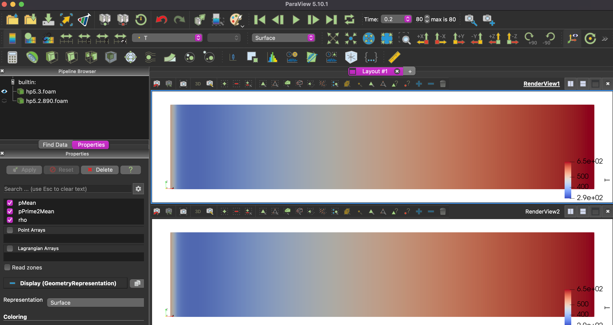

# CFD

### Simulations

#### 1. Couette2

icoFoam

#### 2. FixedTopWall

icoFoam

#### 3. FixedTopWall2

icoFoam

#### 4. flow-over-heated-plate

rhoPimpleFoam

from tutorial with small changes

#### 5. heatedplate1

rhoPimpleFoam, adapted from #4 to square blockmesh

#### 6. heatedplate2

rhoPimpleFoam, adapted from #5 to modify

#### 7. heatedplate3

rhoPimpleFoam, moved from externalHeatFlux... to fixedGradient (boundary condition)

#### 8. heatedplate4

more defined blockmesh and run for 1 second (opposed to .3 s)

#### 9 FixedTopWall3

blockmesh is now 6by1 instead of 1by1. This to find where the flow fully develops

#### 10. heatedplate5

realistic server size. not complete.

#### 11. heatedplate5.1

using fixedGradient = 4400. determined with math. see this [link](https://www.cfd-online.com/Forums/openfoam-pre-processing/175229-fixedgradient-boundary-condition.html) for example of derivaiton. we assume W = 890, k = 12 (est/guess).

#### 12. heatedplate5.2

same as 5.1 but using externalWallHeatFluxTemperature. with Q = 890 W 

#### 13. heatedplate5.3

same as 5.2  but  using heatflux q = 890/(0.450 * 0.090) =~ 22000. 

Simulation shows this is the same as Q = 890. Thus I know what im doing kinda :)

### Paraview

#### How to view wall temp and other boundary values

Access find data by (on top of screen) view > find data  (check)

1. .foam > properties > Mesh Regions - select boundary (patch/lowerWall)

2. Find Data > [dataProducer = .foam , elementType = cell (?) , T >= 0 (to select all) , select boundary , ] > find data > plot over time

Alternatives to this process should become obvious. 

